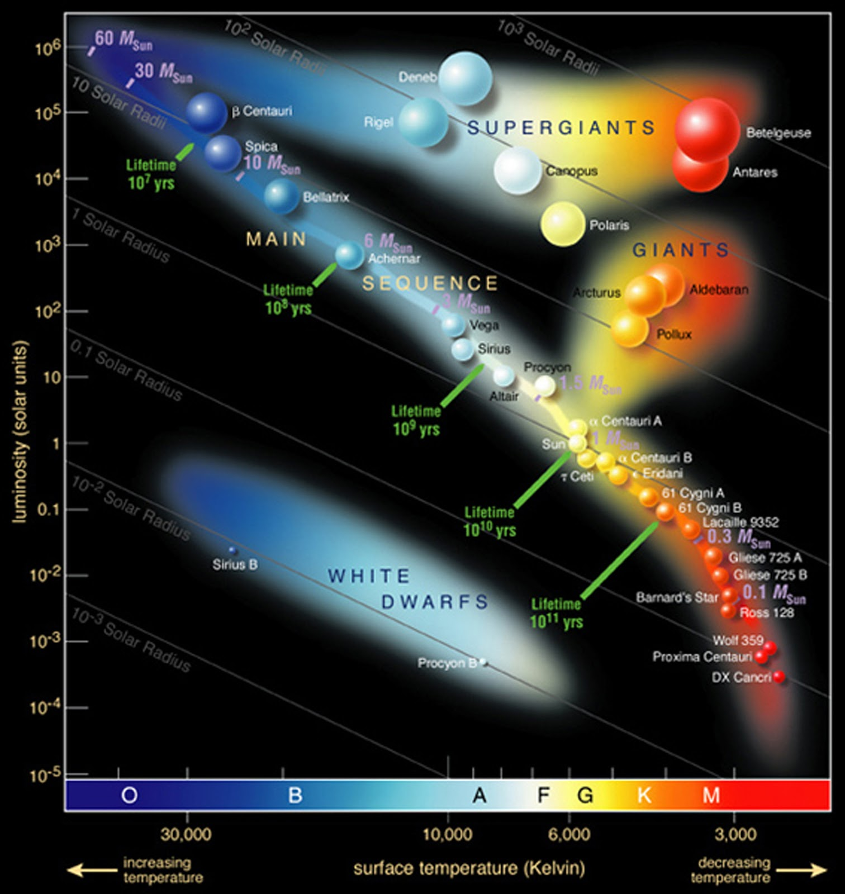
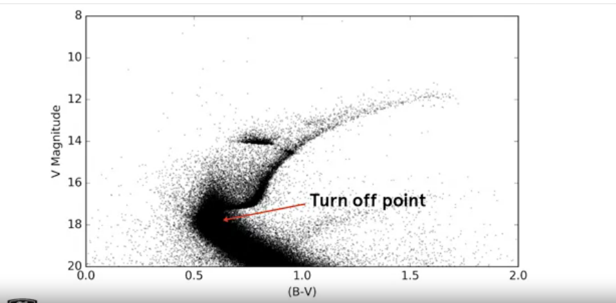

## Exploring a Star Cluster

#### Hertzsprung-Russell diagram

- This is one of the most famous astronomical diagrams, showing the relationship between stars' luminosities or absolute magnitudes and their temperatures. 
- One of the peculiarities of HR diagrams is that the temperature access is reversed increasing to the left. 
- Luminosity increases upwards but be careful when working in magnitudes.
- Brighter stars have lower magnitudes, so if magnitude decreases upwards. 
- Stars on an HR diagram naturally fall into groups.

#### Different parts

- The long diagonal stretching from the lower right to the upper left is called the _main sequence_.
- The most massive stars lay in the upper left and have a bluish color.
- While the low mass stars, the red dwarfs, are cool and
dim, lying in the lower right. 
- The upper right of the diagram is occupied by red giants which are very luminous but also rather cool and hence red in color.
- White dwarfs lie at the bottom of the diagram, below the main sequence.
    - These are generally very hot emitting a lot of energy per unit of surface area.
    - But because of their radii, they do not have large surface areas and are not very luminous. 

- One obstacle when making an HR diagram is that we don't always know what the temperatures are for our stars.
And to know the luminosities we need some information about the stars' distances. Fortunately, there's a convenient solution. 
    - When working with star clusters, we know that the stars within each cluster are approximately the same distance from us. 
    - This means we can use their apparent visual magnitudes without having to know their intrinsic luminosities. 
    - We also tend to measure their colors as Hipparcos did, which serves as a proxy for the temperatures.
        - Cooler stars are red and hotter stars are blue.

#### Color Magnitude Diagram

- Then we use a color magnitude diagram instead.
It has all of the same features as an HR diagram but
plots observable quantities instead of theoretical ones.
- The color magnitude diagram tells us what types of stars dominate the cluster.
    - Stars in a cluster all have the same age and chemical composition or 'metallicity'.
    - In old clusters, the brightest stars are red giants, and the upper left of the main sequence is missing. 
- That's a direct consequence of the inverse relationship between the mass of a star and its lifetime. 
    - The highest stars have become red giants and are no longer on the main sequence.
    - The most massive stars that are still on the main sequence of a cluster represent its turnoff point.
- This can be used to calculate the cluster's age.
    - Older clusters have turn off points that are lower down the main sequence. 
- The distances to clusters can be measured by taking features in the color magnitude diagram and relating their observed brightnesses to theoretically known luminosities. 
- We can use the luminosities of main sequence stars of certain colors in a process known as main-sequence fitting
and we can use the luminosity at the tip of the red giant branch. 
- For the newest clusters, the parallaxes of individual stars within the cluster. As measured by Hipparcos or its successor mission Gaia, can be combined into a statistical parallax to calculate the distance. 
- In this way, clusters give us one rung on the cosmological distance ladder, helping us map the scale of the nearby universe.

_Almost all data analysis in astronomy involves combining information from different sources. Each telescope is highly specialized. And each wavelength we observe at gives us part of the information we need to understand the physical processes that take place in the universe._