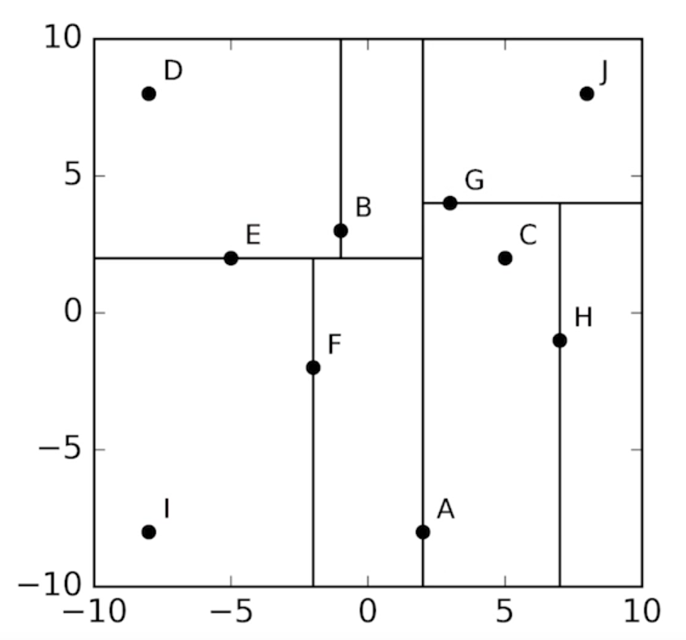

## Reduction
* The astropy module has a cross-matching function that makes it extremely easy to calculate angular distances and cross-match two catalogs.

* Using astropy cross-matching, it took only 25 seconds for two input catalogs of a million sources each.

## K-Dimensional Tree

* A k-d tree, or k-dimensional tree, is a way of representing the points in space in a recursive structure.

*  K is the number of dimensions, which in our case are the two dimensions of our coordinate system, right ascension and declination.

* To construct a k-d tree, you have to recursively partition the space at the median point each time.

* The median point here in the x dimension is A. And so we split the plane at that point, and A becomes the root node of the tree. We then consider points to the left of A and split the plane in the y dimension. And again, at the median point, which is E. We repeat this process, alternating between the x and y dimensions, until the left-hand side of the tree is complete.

* Finally, the process is repeated for the data to the other side of A until every data point in our original dataset is either a node or a leaf in the tree.

* Now once the tree is constructed, you can use this for fast nearest neighbor searching.

* Finds results in O(log n)

* Moving to database also increases speed as it uses CPU cycles.


## What does result of Cross-Matching Mean?

* Nearly all of our radio sources have an optical counterpart, which means we can classify them into two different categories.
    1. Most of our radio galaxies are associated with quasars. Where we're looking towards the central black hole and can see the very energetic accretion disk.
        - The radiation from the accretion disk is so bright that it outshines all of the stars in the galaxy. And therefore, looks just like a bright star, hence the name, quasi-stellar object, or quasar.
    2. The rest of our radio galaxies sit inside normal galaxies, where we can see a cloud of many stars grouped together. This could mean that the supermassive black hole has stopped accreting material. And the radio jets are remnants of past activity.
        - Because we've found optical identifications for most of our radio sources, we can also get redshift for them. This tells us the distance to each galaxy or quasar.

* The redshift for the galaxies range from 0.02 to 0.5, whereas the redshift for the quasars ranges from 0.2 to 3. 

* This tells us most of the galaxies are in the relatively local universe, whereas most of the quasars are typically much further away.

## K-d tree algorithm



* Astropy constructs a k-d tree out of the second catalogue, letting it search through for a match for each object in the first catalogue efficiently. 

* Constructing a k-d tree is similar to the binary search you saw earlier. The k-dimensional space is divided into two parts recursively until each division only contains only a single object. Creating a k-d tree from an astronomy catalogue works like this:

    - Find the object with the median right ascension, split the catalogue into objects left and right partitions of this
    - Find the objects with the median declination in each partition, split the partitions into smaller partitions of objects down and up of these
    - Find the objects with median right ascension in each of the partitions, split the partitions into smaller partitions of objects left and right of these
    - Repeat 2-3 until each partition only has one object in it

* This creates a binary tree where each object used to split a partition (a node) links to the two objects that then split the partitions it has created (its children).


## Finding a match after constructing K-d Tree


Once you've made a k-d tree out of a catalogue, finding a match to an object then works like this:

- Calculate the distance from the object to highest level node (the root node), then go to the child node closest (in right ascension) to the object
- Calculate the distance from the object to this child, then go to the child node closest (in declination) to the object
- Calculate the distance from the object to this child, then go to the child node closest (in right ascension) to the object
- Repeat 2-3 until you reach a child node with no further children (a leaf node)
- Find the shortest distance of all distances calculated, this corresponds to the closest object

* Since each node branches into two children, a catalogue of N objects will have, on average, log2(N) nodes from the root to any leaf. So while it seems like a lot of effort to create a k-d tree, doing so lets you, for example, search the entire SuperCOSMOS catalogue of 250 million objects using only 28 distance calculations.

## Example of Astropy loading

Here's an example of using Astropy to crossmatch two catalogues with 2 objects each:

```
from astropy.coordinates import SkyCoord
from astropy import units as u
coords1 = [[270, -30], [185, 15]]
coords2 = [[185, 20], [280, -30]]
sky_cat1 = SkyCoord(coords1*u.degree, frame='icrs')
sky_cat2 = SkyCoord(coords2*u.degree, frame='icrs')
closest_ids, closest_dists, closest_dists3d = sky_cat1.match_to_catalog_sky(sky_cat2)
print(closest_ids)
print(closest_dists)
```

* The SkyCoord objects are general purpose sky catalogue storage and manipulation objects in Astropy. 
* They take anything that looks like an array of coordinates as long as you specify the units (here we specify degrees with u.degree) and a reference frame (ICRS is essentially the same as equatorial coordinates. 
* The outputs, closest_id and closest_dists give the matching object's row index in sky_cat2 and the distance to it. closest_dists is the angular distance while closest_dists3d is the 3D distance which we're not concerned with here.

* Note

Astropy returns distances as Quantity objects. You can convert these to NumPy arrays by accessing their value attribute like this:

`closest_dists_array = closest_dists.value`